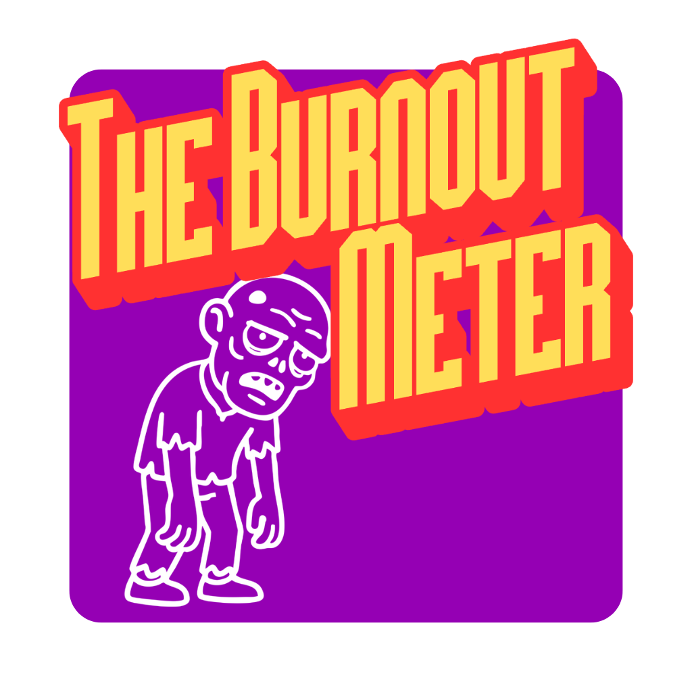
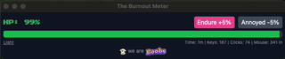
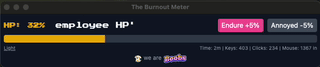
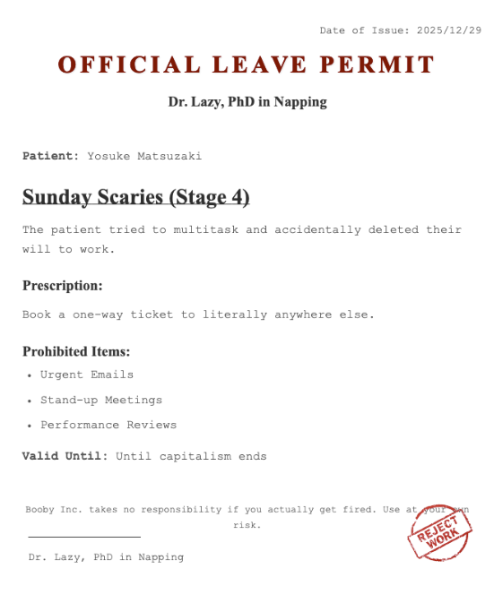

# The Burnout Meter

**Scientific proof that you are working too hard.**



[Watch Demo on YouTube](https://youtu.be/cSr_E1NsggA?si=hL3zohnRKyLyAnBq)

---

## What is this?

**The Burnout Meter** is a desktop application for macOS and Windows that monitors your keystrokes and mouse movements to scientifically calculate your "HP" (Hit Points).

As you work, your HP drains. When it hits zero, you are legally* allowed to go home.
*(*Not legally binding in any known jurisdiction, but it should be.)*

> **"White-collar work is manual labor."**
> Society says we just "sit at desks." Wrong. We run marathons with our fingers. We drift miles with our mouse. This app visualizes that invisible fatigue.


---

## How It Works

### 1. Total Surveillance

The app sithe bottom of your screen (or wherever you drag it). It watches every move.

* **Keystrokes:** Each keypress deals damage to your soul.
* **Mouse Distance:** Every pixel traveled is energy lost.



### 2. The HP System

You start the day with **100% HP**.
The algorithm converts your productivity directly into damage. The harder you work, the faster you die (digitally).

* **Green Zone:** You are safe (Slacking off).
* **Red Zone:** Danger. You are being "productive."



### 3. Dr. Lazy’s Cure

Did you hit **0% HP**? Congratulations.
The app instantly generates an **"Official Leave Permit"** signed by Dr. Lazy, PhD in Napping. Print it out. Slam it on your boss's desk. Walk away.



---

## Tech Stack

Built with hate, caffeine, and:

* **[Tauri](https://tauri.app/):** For a tiny footprint (unlike Electron, which is bloatwar* **[React](https://reactjs.org/):** Because we like suffering.
* **[Vite](https://vitejs.dev/):** For speed (so we can finish coding and nap).
* **[TypeScript](https://www.typescriptlang.org/):** To catch errors before our boss does.

---

## Installation (For Developers)

Do you want to contribute? Why? Go rest.
But if you must run this locally:

### Prerequisites

* **Rust & Cargo** (For Tauri)
* **Node.js** (For the frontend)

### Setup

1. **Clone the repository** (Don't strain your fingers):
```bash
git clone https://github.com/Booby-Boobs/burnout-meter.git
cd burnout-meter
```


2. **Install dependencies**:
```bash
npm install
```


3. **Run in development mode**:
```bash
npm run tauri dev
```


4. **Build for release** (If you want to infect your colleagues):
```bash
npm run tauri build
```


---

## ⚠️ Disclaimer

**Booby Inc. takes no responsibility for:**

* Missed deadlines.
* Angry managers.
* Sudden unemployment.
* The realization that your job is meaningless.

This software is pro"as is" for entertainment purposes only. Please don't actually get fired (unless you want to).

---

## Download

**Get the compiled binaries for macOS & Windows here:**
👉 **[GitHub Releases](https://github.com/Booby-Boobs/burnout-meter/releases/tag/v0.1.0)**

---

**Made with 💔 by [Booby Inc.**](https://booby.dev)
*We Engineer Unproductivity.*